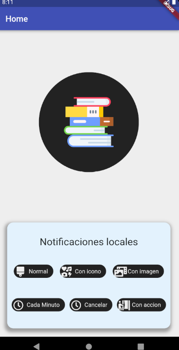
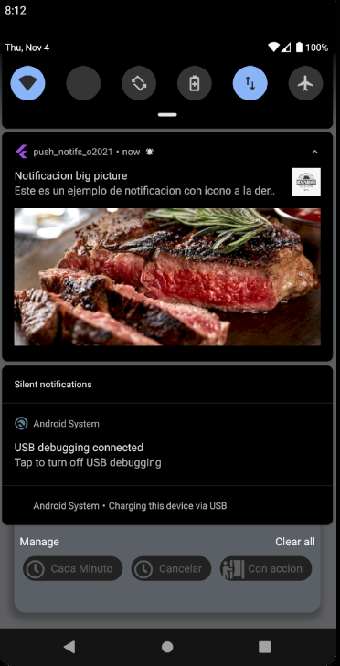

# App 22

App para practicar los siguientes temas:
- Local notifications

## Getting Started

Recuerda que despues de clonar el proyecto, abrir una terminal dentro de la carpeta del proyecto y ejecutar el comando:

```sh
flutter packages get
``` 

## App Screenshot





